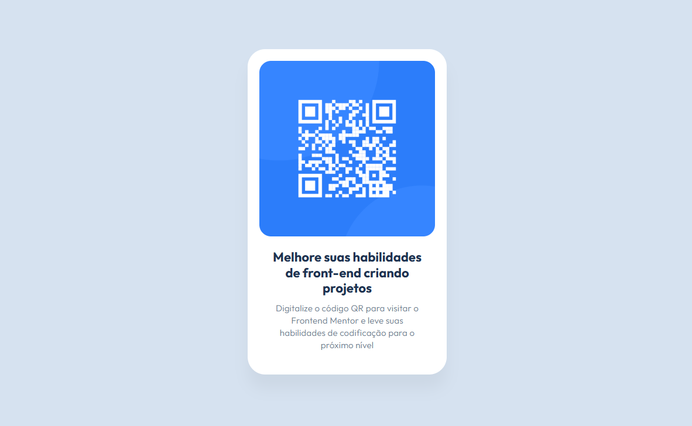

# Componente de Código QR

Este projeto é uma solução para o desafio do [Frontend Mentor](https://www.frontendmentor.io/challenges/qr-code-component-iux_sIO_H) - **Componente de Código QR**.  
O objetivo foi construir um componente de código QR seguindo o design fornecido e garantir que ele fosse responsivo em diferentes tamanhos de tela.

---

## 👀 Visão Geral

### 🎯 O Desafio

Usuários devem ser capazes de:

- Ver o layout ideal para o componente, dependendo do tamanho da tela do dispositivo.

---

## 🖼️ Screenshot

---

## 🔗 Links

- **URL da Solução:** [Repositório no GitHub](https://github.com/juliamariaa/qr-code-component)  
- **Demonstração ao Vivo:** [Visualizar Projeto](https://juliamariaa.github.io/qr-code-component/)

---

## 🚀 Como Rodar o Projeto Localmente

Para rodar este projeto em sua máquina local, siga os passos:

### Clone o repositório:

git clone https://github.com/juliamariaa/qr-code-component

## 👩‍💻 Sobre a autora

**Júlia Maria** é desenvolvedora front-end apaixonada por transformar ideias em interfaces funcionais e impactantes. Atua com foco em design, usabilidade e performance, compartilhando seu conhecimento e projetos nas redes abaixo:

- 🔗 [LinkedIn](https://www.linkedin.com/in/juliamaria/)
- 💻 [GitHub](https://github.com/juliamariadev)  
- 📸 [Instagram](https://www.instagram.com/juliamaria.dev/)  
- 🎨 [Behance](https://www.behance.net/juliamariadev)
