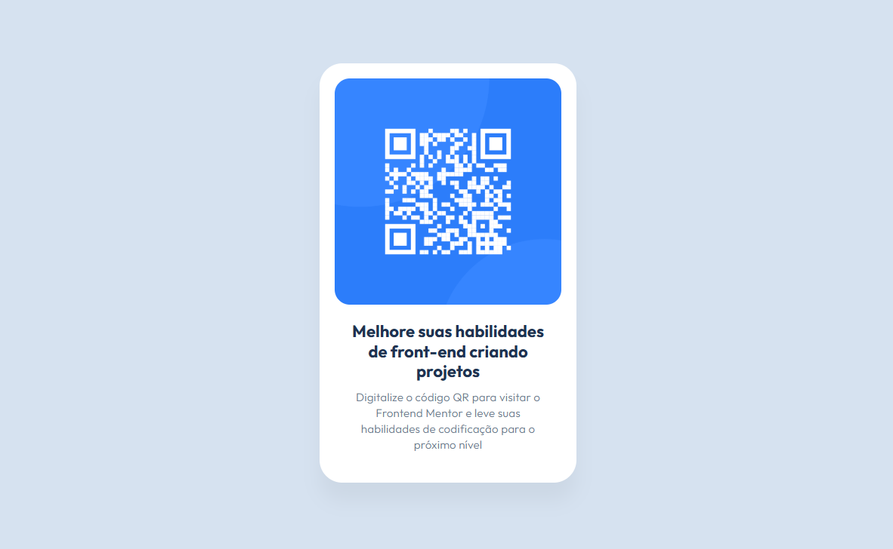

Componente de Código QR
Desafio do Frontend Mentor
Este projeto é uma solução para o desafio de código do Frontend Mentor - Componente de Código QR. O objetivo foi construir um componente de código QR seguindo o design fornecido e garantir que ele fosse responsivo em diferentes tamanhos de tela.

Visão Geral
O Desafio
Usuários devem ser capazes de:

Ver o layout ideal para o componente, dependendo do tamanho da tela do dispositivo.

Screenshot

Links
URL da Solução: https://github.com/juliamariaa/qr-code-component

URL da Demonstração ao Vivo: https://juliamariaa.github.io/qr-code-component/

Como Rodar o Projeto Localmente
Para rodar este projeto em sua máquina local, siga os passos:

Clone o repositório:

Bash

git clone https://docs.github.com/articles/referencing-and-citing-content
Navegue até o diretório do projeto:

Bash

cd nome-do-seu-repositorio
Abra o arquivo index.html em seu navegador ou utilize uma extensão de "Live Server" em seu editor de código para visualização.

Autor
Júlia Maria 

GitHub: @juliamariadev
LinkedIn: https://www.linkedin.com/in/j%C3%BAlia-maria/
Instagram: https://www.instagram.com/juliamaria.dev/#
Behance: https://www.behance.net/juliamariadev

